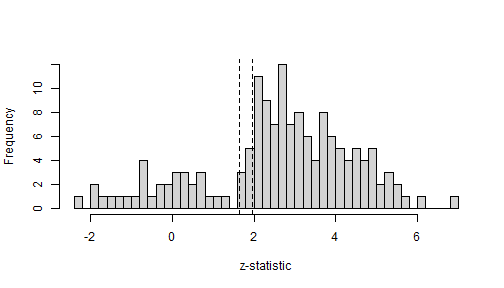
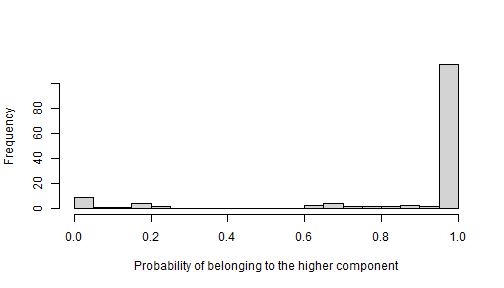
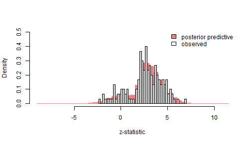
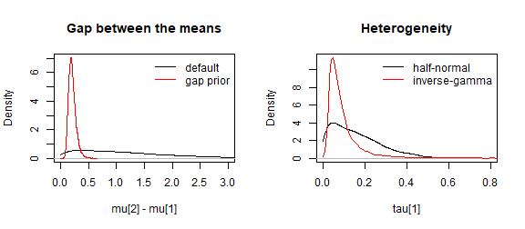

# Getting started

metamixr fits Bayesian random-effects meta-analytic mixture models: the
true effects of the primary studies are assumed to come from a mixture
of `M` normal components, each with its own mean and between-study
heterogeneity. The mixture can be combined with a step-function
selection model to adjust for publication bias. All models are estimated
with Stan and returned as `stanfit` objects. All downstream operations
(e.g., summarizing outputs and checking diagnostics) are therefore based
on rstan. See Maier (2026) for more information.

This vignette walks through a simple workflow on simulated data:
simulating a meta-analysis, fitting the models, comparing them with
bridge sampling, and checking the fit with posterior predictive draws.

``` r

library(metamixr)
library(rstan)
```

## Simulating a meta-analysis

[`sim_mix()`](https://maxmaier42.github.io/metamix/reference/sim_mix.md)
simulates published studies from a selection model. The code below
simulates 150 studies (`K = 150`) from a two-component mixture (`M = 2`)
with means `mu = c(0, 0.5)` and heterogeneity of 0.1 in each cluster
(`tau = c(0.1, 0.1)`). The cutoffs are passed as
`steps = c(0.95, 0.975)`: these are cumulative probabilities of the
standard normal distribution, so `qnorm(steps)` are the cutoffs on the
z-statistic (1.64 and 1.96). Together with `weights = c(0.2, 0.5, 1)`
this means that non-significant studies are 20% as likely to be
published as significant studies (one-sided p \< .025, i.e. significant
on a two-sided test) and marginally significant studies (.025 \< p \<
.05) are 50% as likely to be published as significant studies.

``` r

set.seed(2026)
dat <- sim_mix(K = 150, M = 2, mu = c(0, 0.5), tau = c(0.1, 0.1),
               steps = c(0.95, 0.975), weights = c(0.2, 0.5, 1),
               one_sided = TRUE)
head(dat)
#>            y       sds
#> 1 -0.3305226 0.1760924
#> 2  0.7027334 0.1769995
#> 3  0.4683970 0.1052349
#> 4 -0.2729853 0.1865030
#> 5  0.7392605 0.1354404
#> 6 -0.1507423 0.2481200
```

The selection is visible in the distribution of the z-statistics, which
piles up above the significance cutoffs.

``` r

z <- dat$y / dat$sds
hist(z, breaks = 40, main = "", xlab = "z-statistic")
abline(v = qnorm(c(0.95, 0.975)), lty = 2)
```



plot of chunk z-hist

## Random-effects mixture models

[`re_mix()`](https://maxmaier42.github.io/metamix/reference/re_mix.md)
fits the mixture model without any adjustment for publication bias. With
`M = 1` it fits an ordinary Bayesian random-effects meta-analysis.

``` r

fit_re1 <- re_mix(dat$y, dat$sds, M = 1, chains = 4, cores = 4, seed = 1, refresh = 0)
fit_re2 <- re_mix(dat$y, dat$sds, M = 2, chains = 4, cores = 4, seed = 1, refresh = 0)
print(fit_re1, pars = c("mu", "tau"))
#> Inference for Stan model: random_effects_mix.
#> 4 chains, each with iter=2000; warmup=1000; thin=1; 
#> post-warmup draws per chain=1000, total post-warmup draws=4000.
#> 
#>        mean se_mean   sd 2.5%  25%  50%  75% 97.5% n_eff Rhat
#> mu[1]  0.46       0 0.02 0.41 0.45 0.46 0.48  0.51  3263    1
#> tau[1] 0.23       0 0.02 0.18 0.21 0.23 0.24  0.27  2650    1
#> 
#> Samples were drawn using NUTS(diag_e) at Wed Sep 23 15:51:44 2026.
#> For each parameter, n_eff is a crude measure of effective sample size,
#> and Rhat is the potential scale reduction factor on split chains (at 
#> convergence, Rhat=1).
print(fit_re2, pars = c("mu", "tau", "theta"))
#> Inference for Stan model: random_effects_mix.
#> 4 chains, each with iter=2000; warmup=1000; thin=1; 
#> post-warmup draws per chain=1000, total post-warmup draws=4000.
#> 
#>           mean se_mean   sd  2.5%   25%   50%   75% 97.5% n_eff Rhat
#> mu[1]    -0.10       0 0.09 -0.23 -0.15 -0.11 -0.06  0.14   660    1
#> mu[2]     0.54       0 0.02  0.51  0.53  0.54  0.55  0.58  3025    1
#> tau[1]    0.10       0 0.08  0.00  0.04  0.08  0.14  0.29   790    1
#> tau[2]    0.05       0 0.03  0.00  0.03  0.05  0.07  0.12  1354    1
#> theta[1]  0.15       0 0.05  0.08  0.12  0.14  0.17  0.27   905    1
#> theta[2]  0.85       0 0.05  0.73  0.83  0.86  0.88  0.92   905    1
#> 
#> Samples were drawn using NUTS(diag_e) at Wed Sep 23 15:52:25 2026.
#> For each parameter, n_eff is a crude measure of effective sample size,
#> and Rhat is the potential scale reduction factor on split chains (at 
#> convergence, Rhat=1).
```

`mu` denotes the component means, `tau` is the heterogeneity in each
component and `theta` the mixing weights. Because non-significant
studies are under-represented in the published data, the models that
ignore selection overestimate the effect sizes. The one-component model
estimates a mean of about 0.46, far above the average true effect of
0.25, and the two-component model attributes only about 15% of the
studies to its lower component, whereas half of the conducted studies
come from the null component.

Each fit also contains `posterior_probs`, the posterior probability that
a study belongs to each component, which can be used to classify the
cluster membership of individual studies.

``` r

probs <- rstan::extract(fit_re2, pars = "posterior_probs")$posterior_probs
p_high <- colMeans(probs[, , 2])   # posterior probability of the higher component per study
hist(p_high, breaks = 20, main = "", xlab = "Probability of belonging to the higher component")
```



plot of chunk classify

## Adjusting for publication bias

[`sel_mix()`](https://maxmaier42.github.io/metamix/reference/sel_mix.md)
adds a step-function selection model: each study falls into one of the
p-value intervals defined by `steps`, and the relative publication
probabilities `omega` of these intervals are estimated jointly with the
mixture. The weights are monotonically increasing and the weight of the
most significant interval is fixed at 1.

``` r

fit_sel1 <- sel_mix(dat$y, dat$sds, M = 1, steps = c(0.95, 0.975),
                    chains = 4, cores = 4, seed = 1, refresh = 0)
fit_sel2 <- sel_mix(dat$y, dat$sds, M = 2, steps = c(0.95, 0.975),
                    chains = 4, cores = 4, seed = 1, refresh = 0)
print(fit_sel2, pars = c("mu", "tau", "theta", "theta_preselection", "omega"))
#> Inference for Stan model: selection_mix.
#> 4 chains, each with iter=2000; warmup=1000; thin=1; 
#> post-warmup draws per chain=1000, total post-warmup draws=4000.
#> 
#>                        mean se_mean   sd  2.5%   25%   50%  75% 97.5% n_eff
#> mu[1]                 -0.05       0 0.08 -0.19 -0.11 -0.06 0.00  0.12   910
#> mu[2]                  0.53       0 0.03  0.46  0.51  0.53 0.55  0.59  1555
#> tau[1]                 0.13       0 0.08  0.01  0.06  0.12 0.18  0.28   843
#> tau[2]                 0.07       0 0.04  0.00  0.03  0.06 0.09  0.15  1788
#> theta[1]               0.23       0 0.10  0.10  0.16  0.21 0.28  0.48   902
#> theta[2]               0.77       0 0.10  0.52  0.72  0.79 0.84  0.90   902
#> theta_preselection[1]  0.46       0 0.16  0.20  0.34  0.45 0.57  0.77  1005
#> theta_preselection[2]  0.54       0 0.16  0.23  0.43  0.55 0.66  0.80  1005
#> omega[1]               0.25       0 0.12  0.08  0.16  0.23 0.32  0.52  1727
#> omega[2]               0.54       0 0.19  0.22  0.39  0.52 0.67  0.93  1627
#> omega[3]               1.00       0 0.00  1.00  1.00  1.00 1.00  1.00  3311
#>                       Rhat
#> mu[1]                    1
#> mu[2]                    1
#> tau[1]                   1
#> tau[2]                   1
#> theta[1]                 1
#> theta[2]                 1
#> theta_preselection[1]    1
#> theta_preselection[2]    1
#> omega[1]                 1
#> omega[2]                 1
#> omega[3]                 1
#> 
#> Samples were drawn using NUTS(diag_e) at Wed Sep 23 15:56:00 2026.
#> For each parameter, n_eff is a crude measure of effective sample size,
#> and Rhat is the potential scale reduction factor on split chains (at 
#> convergence, Rhat=1).
```

The estimated weights recover the selection used in the simulation (0.2,
0.5, 1), and the component means move back towards their true values 0
and 0.5. `theta` are the mixing weights among the published studies,
whereas `theta_preselection` corrects them for selection and estimates
the proportions among all conducted studies; `theta_preselection` for
the null component is larger than `theta` because its studies are less
likely to be published.

## Comparing models

The Stan programs keep all normalising constants, so the marginal
likelihood of the data under each model can be estimated with the
bridgesampling package (Gronau, Singmann, & Wagenmakers, 2020) and used
for model selection.

``` r

library(bridgesampling)
fits <- list(re_mix1 = fit_re1, re_mix2 = fit_re2,
             sel_mix1 = fit_sel1, sel_mix2 = fit_sel2)
logml <- sapply(fits, function(f) bridge_sampler(f, silent = TRUE)$logml)
post_prob <- exp(logml - max(logml)) / sum(exp(logml - max(logml)))
round(cbind(logml = logml, post_prob = post_prob), 3)
#>            logml post_prob
#> re_mix1  -39.978     0.000
#> re_mix2  -25.931     0.004
#> sel_mix1 -25.037     0.009
#> sel_mix2 -20.347     0.987
```

The two-component selection model, i.e. the data-generating model,
receives almost all of the posterior probability.

## Posterior predictive check

Every fit contains posterior predictive draws `y_rep` and `sd_rep` of a
data set of the same size as the observed one. For the selection models
these draws include the selection step, so they can be compared directly
with the published data. The code below compares the observed
z-statistics with the predicted distribution of z-statistics from the
selected model.

``` r

rep <- rstan::extract(fit_sel2, pars = c("y_rep", "sd_rep"))
z_rep <- rep$y_rep / rep$sd_rep
hist(z_rep, breaks = 60, freq = FALSE, col = "lightcoral", border = "lightcoral",
     main = "", xlab = "z-statistic", ylim = c(0, 0.5))
hist(z, breaks = 40, freq = FALSE, add = TRUE)
legend("topright", legend = c("posterior predictive", "observed"),
       fill = c("lightcoral", NA), bty = "n")
```



plot of chunk ppc

## Alternative priors

By default the component means have independent normal(0, `mu_sd`)
priors and the heterogeneities half-normal(0, `tau_sd`) priors. Two
alternative specifications are available (Maier, 2026):

- `mean_prior = "gap"` keeps the normal prior for the first mean only
  and places a lognormal prior on the gaps between adjacent means. Its
  density vanishes at a gap of zero, so it is *repulsive*: two
  components are discouraged from collapsing onto the same location.
- `tau_prior = "inv_gamma"` replaces the half-normal prior on the
  heterogeneities by an inverse-gamma prior, which is a common prior
  choice for heterogeneity in Bayesian meta-analysis.

Setting `prior_only = TRUE` draws from the prior without using the data,
which is a convenient way to see what a prior implies. The densities
below compare the default setting with the gap prior on the component
means combined with the inverse-gamma prior on the heterogeneity.

``` r

prior_default <- sel_mix(dat$y, dat$sds, M = 2, steps = c(0.95, 0.975), prior_only = TRUE,
                         chains = 1, iter = 20000, seed = 1, refresh = 0)
prior_alt <- sel_mix(dat$y, dat$sds, M = 2, steps = c(0.95, 0.975), prior_only = TRUE,
                     mean_prior = "gap", tau_prior = "inv_gamma",
                     chains = 1, iter = 20000, seed = 1, refresh = 0)
d_default <- rstan::extract(prior_default, pars = c("mu_gap", "tau"))
d_alt     <- rstan::extract(prior_alt, pars = c("mu_gap", "tau"))
gap_default <- density(d_default$mu_gap, from = 0)
gap_alt     <- density(d_alt$mu_gap, from = 0)
tau_default <- density(d_default$tau[, 1], from = 0)
tau_alt     <- density(d_alt$tau[, 1], from = 0)
par(mfrow = c(1, 2))
plot(gap_default, xlim = c(0, 3), ylim = c(0, max(gap_default$y, gap_alt$y)),
     main = "Gap between the means", xlab = "mu[2] - mu[1]")
lines(gap_alt, col = "red")
legend("topright", legend = c("default", "gap prior"), col = c("black", "red"), lty = 1, bty = "n")
plot(tau_default, xlim = c(0, 0.8), ylim = c(0, max(tau_default$y, tau_alt$y)),
     main = "Heterogeneity", xlab = "tau[1]")
lines(tau_alt, col = "red")
legend("topright", legend = c("half-normal", "inverse-gamma"), col = c("black", "red"), lty = 1, bty = "n")
```



plot of chunk priors

``` r

par(mfrow = c(1, 1))
```

Refitting the two-component selection model with the alternative priors
leaves the second component and the selection weights essentially
unchanged, but shifts the null component: the inverse-gamma prior keeps
its heterogeneity away from zero, and its mean and mixing weight
increase. With only 150 studies the prior on the less well identified
component still matters, so it is worth checking the sensitivity of the
conclusions to the prior choice.

``` r

fit_sel2_alt <- sel_mix(dat$y, dat$sds, M = 2, steps = c(0.95, 0.975),
                        mean_prior = "gap", tau_prior = "inv_gamma",
                        chains = 4, cores = 4, seed = 1, refresh = 0)
pars <- c("mu", "tau", "theta", "omega")
round(cbind(default     = rstan::summary(fit_sel2, pars = pars)$summary[, "mean"],
            alternative = rstan::summary(fit_sel2_alt, pars = pars)$summary[, "mean"]), 3)
#>          default alternative
#> mu[1]     -0.051       0.086
#> mu[2]      0.527       0.526
#> tau[1]     0.126       0.180
#> tau[2]     0.065       0.063
#> theta[1]   0.232       0.348
#> theta[2]   0.768       0.652
#> omega[1]   0.251       0.272
#> omega[2]   0.537       0.506
#> omega[3]   1.000       1.000
```

## References

Gronau, Q. F., Singmann, H., & Wagenmakers, E.-J. (2020).
bridgesampling: An R package for estimating normalizing constants.
*Journal of Statistical Software*, 92(10), 1–29.
<https://doi.org/10.18637/jss.v092.i10>

Maier, M. (2026). Addressing heterogeneity with Bayesian meta-analytic
mixture modelling. *PsyArXiv*.
<https://doi.org/10.31234/osf.io/nkyqm_v2>
