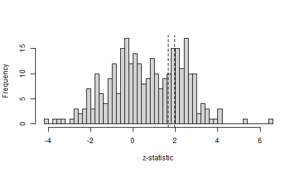

This vignette validates the random effects meta analysis and selection model
implementation in metamixr against RoBMA. RoBMA priors are set to the metamixr defaults
(normal(0, 1) on the mean and half-normal(0, 0.2) on the heterogeneity) so
that the two packages estimate the same model. Also see Maier (2026) for a more in depth
simulation study validating the mixture models. Reproducing this vignette requires RoBMA (version
4.0.0 or later) and JAGS in addition to package dependencies.


``` r
library(metamixr)
library(rstan)
library(RoBMA)
```

## Random-effects meta-analysis

We simulate 300 studies with a true mean effect of 0 and heterogeneity 0.2.
We can use the function \texttt{sim_mix} from the package to specify a normal
random effects meta-analysis by setting M = 1 and weights = c(1,1,1)
(all studies equally likely to be published).


``` r
set.seed(42)
dat <- sim_mix(K = 300, M = 1, mu = 0, tau = 0.2, steps = c(0.95, 0.975),
               weights = c(1, 1, 1), one_sided = TRUE)
```

The random-effects model in metamixr can be fit using `re_mix()` with a single component; in
RoBMA it can be fitted using `brma()`.


``` r
fit_metamix <- re_mix(dat$y, dat$sds, M = 1, chains = 4, cores = 4, seed = 1, refresh = 0)

fit_RoBMA <- brma(yi = dat$y, sei = dat$sds, measure = "GEN",
                  prior_effect = prior("normal", list(0, 1)),
                  prior_heterogeneity = prior("normal", list(0, 0.2), list(0, Inf)),
                  chains = 4, sample = 1000, burnin = 1000, parallel = TRUE, seed = 1)
#> Compiling rjags model...
#> Starting 4 rjags simulations using a PSOCK cluster with 4 nodes on host
#> 'localhost'
#> Simulation complete
#> Finished running the simulation
```

Both implementations recover the data-generating values and agree closely.


``` r
print(fit_metamix, pars = c("mu", "tau"))
#> Inference for Stan model: random_effects_mix.
#> 4 chains, each with iter=2000; warmup=1000; thin=1; 
#> post-warmup draws per chain=1000, total post-warmup draws=4000.
#> 
#>         mean se_mean   sd  2.5%   25%   50%   75% 97.5% n_eff Rhat
#> mu[1]  -0.04       0 0.01 -0.07 -0.05 -0.04 -0.03 -0.01  3397    1
#> tau[1]  0.18       0 0.02  0.15  0.17  0.18  0.19  0.21  3318    1
#> 
#> Samples were drawn using NUTS(diag_e) at Tue Sep 22 12:35:32 2026.
#> For each parameter, n_eff is a crude measure of effective sample size,
#> and Rhat is the potential scale reduction factor on split chains (at 
#> convergence, Rhat=1).
summary(fit_RoBMA)
#> 
#> Bayesian Random-Effects Model (k = 300)
#> 
#> Estimates
#>       Mean    SD  0.025    0.5  0.975 error(MCMC) error(MCMC)/SD  ESS R-hat
#> mu  -0.039 0.016 -0.071 -0.039 -0.008     0.00025          0.016 4000 1.000
#> tau  0.180 0.016  0.149  0.180  0.211     0.00031          0.020 2471 1.001
```

## One-sided selection

Next we simulate publication bias using sim_mix. Studies that are not significant in the
expected direction (p > .05 in one-sided test) are published with probability 0.2, marginally significant studies
(.025 < p < .05) with probability 0.5, and significant studies with
probability 1.


``` r
set.seed(123)
dat_pb <- sim_mix(K = 300, M = 1, mu = 0, tau = 0.2, steps = c(0.95, 0.975),
                  weights = c(0.2, 0.5, 1), one_sided = TRUE)
```

Let's plot the distribution of z statistics to visually inspect the simulated publciation bias.


``` r
z <- dat_pb$y / dat_pb$sds
hist(z, breaks = 60, main = "", xlab = "z-statistic")
abline(v = qnorm(c(0.95, 0.975)), lty = 2)
```



The two packages state the same cutoffs differently. metamixr takes cumulative
probabilities of the standard normal distribution, `steps = c(0.95, 0.975)`,
so that `qnorm(steps)` are the cutoffs on the z-statistic. RoBMA takes the
one-sided p-values, `steps = c(0.025, 0.05)`. To validate the metamixr implementation
we restrict RoBMA to fit only a single selection model corresponding to
the implementation of the selection model in metamixr.


``` r
fit_metamix_pb <- sel_mix(dat_pb$y, dat_pb$sds, M = 1, steps = c(0.95, 0.975),
                          chains = 4, cores = 4, seed = 1, refresh = 0)

fit_RoBMA_pb <- bselmodel(yi = dat_pb$y, sei = dat_pb$sds, measure = "GEN",
                          prior_effect = prior("normal", list(0, 1)),
                          prior_heterogeneity = prior("normal", list(0, 0.2), list(0, Inf)),
                          prior_bias = prior_weightfunction(side = "one-sided",
                                                            steps = c(0.025, 0.05)),
                          effect_direction = "positive",
                          chains = 4, sample = 1000, burnin = 1000, parallel = TRUE, seed = 1)
#> Compiling rjags model...
#> Starting 4 rjags simulations using a PSOCK cluster with 4 nodes on host
#> 'localhost'
#> Simulation complete
#> Finished running the simulation
```

Again the estimates agree between the two approaches to fitting the same selection model.


``` r
print(fit_metamix_pb, pars = c("mu", "tau", "omega"))
#> Inference for Stan model: selection_mix.
#> 4 chains, each with iter=2000; warmup=1000; thin=1; 
#> post-warmup draws per chain=1000, total post-warmup draws=4000.
#> 
#>          mean se_mean   sd  2.5%  25%  50%  75% 97.5% n_eff Rhat
#> mu[1]    0.02       0 0.02 -0.03 0.00 0.02 0.03  0.06  2302    1
#> tau[1]   0.20       0 0.02  0.17 0.19 0.20 0.21  0.23  2174    1
#> omega[1] 0.29       0 0.07  0.18 0.24 0.29 0.34  0.46  2095    1
#> omega[2] 0.57       0 0.15  0.32 0.45 0.55 0.67  0.90  2040    1
#> omega[3] 1.00       0 0.00  1.00 1.00 1.00 1.00  1.00   134    1
#> 
#> Samples were drawn using NUTS(diag_e) at Tue Sep 22 12:38:42 2026.
#> For each parameter, n_eff is a crude measure of effective sample size,
#> and Rhat is the potential scale reduction factor on split chains (at 
#> convergence, Rhat=1).
summary(fit_RoBMA_pb)
#> 
#> Bayesian Random-Effects Selection Model (k = 300)
#> 
#> Estimates
#>      Mean    SD  0.025   0.5 0.975 error(MCMC) error(MCMC)/SD  ESS R-hat
#> mu  0.017 0.024 -0.030 0.017 0.063     0.00096          0.040  729 1.013
#> tau 0.202 0.016  0.171 0.202 0.235     0.00046          0.029 1230 1.003
#> 
#> Publication Bias
#>                    Mean    SD 0.025   0.5 0.975 error(MCMC) error(MCMC)/SD ESS
#> omega[0,0.025]    1.000 0.000 1.000 1.000 1.000          NA             NA  NA
#> omega[0.025,0.05] 0.568 0.147 0.322 0.552 0.891     0.00578          0.039 644
#> omega[0.05,1]     0.293 0.073 0.174 0.284 0.463     0.00313          0.043 599
#>                   R-hat
#> omega[0,0.025]       NA
#> omega[0.025,0.05] 1.010
#> omega[0.05,1]     1.011
#> P-value intervals for publication bias weights omega correspond to one-sided p-values.
```

## Two-sided selection

We next compare the two methods for two sided selection, where significance in either
direction increases the probability of publication. In metamixr this is
`one_sided = FALSE`; in RoBMA it is `side = "two-sided"` in the weight
function prior.


``` r
set.seed(123)
dat_pb2 <- sim_mix(K = 300, M = 1, mu = 0, tau = 0.2, steps = c(0.95, 0.975),
                   weights = c(0.2, 0.5, 1), one_sided = FALSE)

fit_metamix_pb2 <- sel_mix(dat_pb2$y, dat_pb2$sds, M = 1, steps = c(0.95, 0.975),
                           one_sided = FALSE, chains = 4, cores = 4, seed = 1, refresh = 0)

fit_RoBMA_pb2 <- bselmodel(yi = dat_pb2$y, sei = dat_pb2$sds, measure = "GEN",
                           prior_effect = prior("normal", list(0, 1)),
                           prior_heterogeneity = prior("normal", list(0, 0.2), list(0, Inf)),
                           prior_bias = prior_weightfunction(side = "two-sided",
                                                             steps = c(0.025, 0.05)),
                           chains = 4, sample = 1000, burnin = 1000, parallel = TRUE, seed = 1)
#> Compiling rjags model...
#> Starting 4 rjags simulations using a PSOCK cluster with 4 nodes on host
#> 'localhost'
#> Simulation complete
#> Finished running the simulation
```


``` r
print(fit_metamix_pb2, pars = c("mu", "tau", "omega"))
#> Inference for Stan model: selection_mix.
#> 4 chains, each with iter=2000; warmup=1000; thin=1; 
#> post-warmup draws per chain=1000, total post-warmup draws=4000.
#> 
#>          mean se_mean   sd  2.5%   25%  50%  75% 97.5% n_eff Rhat
#> mu[1]    0.00       0 0.01 -0.03 -0.01 0.00 0.00  0.02  2464    1
#> tau[1]   0.23       0 0.02  0.20  0.22 0.23 0.24  0.26  2930    1
#> omega[1] 0.31       0 0.06  0.22  0.27 0.31 0.35  0.43  3086    1
#> omega[2] 0.50       0 0.11  0.31  0.42 0.49 0.57  0.75  2093    1
#> omega[3] 1.00       0 0.00  1.00  1.00 1.00 1.00  1.00   256    1
#> 
#> Samples were drawn using NUTS(diag_e) at Tue Sep 22 12:44:07 2026.
#> For each parameter, n_eff is a crude measure of effective sample size,
#> and Rhat is the potential scale reduction factor on split chains (at 
#> convergence, Rhat=1).
summary(fit_RoBMA_pb2)
#> 
#> Bayesian Random-Effects Selection Model (k = 300)
#> 
#> Estimates
#>       Mean    SD  0.025    0.5 0.975 error(MCMC) error(MCMC)/SD  ESS R-hat
#> mu  -0.004 0.014 -0.031 -0.004 0.023     0.00029          0.021 2245 1.002
#> tau  0.227 0.018  0.193  0.226 0.262     0.00060          0.034  874 1.001
#> 
#> Publication Bias
#>                    Mean    SD 0.025   0.5 0.975 error(MCMC) error(MCMC)/SD  ESS
#> omega[0,0.025]    1.000 0.000 1.000 1.000 1.000          NA             NA   NA
#> omega[0.025,0.05] 0.871 0.095 0.651 0.891 0.995     0.00296          0.031 1022
#> omega[0.05,1]     0.315 0.057 0.217 0.310 0.440     0.00185          0.033  944
#>                   R-hat
#> omega[0,0.025]       NA
#> omega[0.025,0.05] 1.008
#> omega[0.05,1]     1.002
#> P-value intervals for publication bias weights omega correspond to one-sided p-values.
```

## References

Bartoš, F., Maier, M., Wagenmakers, E.-J., Doucouliagos, H., & Stanley, T. D.
(2023). Robust Bayesian meta-analysis: Model-averaging across complementary
publication bias adjustment methods. *Research Synthesis Methods*, 14(1),
99--116. https://doi.org/10.1002/jrsm.1594

Maier, M. (2026). Addressing heterogeneity with Bayesian meta-analytic
mixture modelling. *PsyArXiv*. https://doi.org/10.31234/osf.io/nkyqm_v2

Maier, M., Bartoš, F., & Wagenmakers, E.-J. (2023). Robust Bayesian
meta-analysis: Addressing publication bias with model-averaging.
*Psychological Methods*, 28(1), 107--122. https://doi.org/10.1037/met0000405
