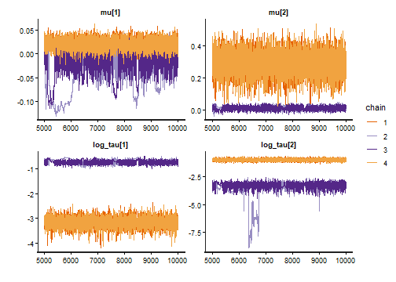
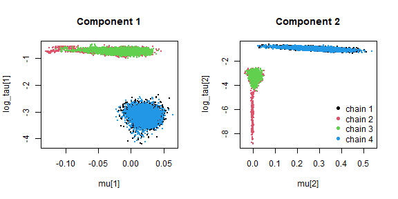

The posterior distribution of a mixture model can have several modes. The
component means in metamixr are ordered, which removes the label switching
between components, but other possible sources of multimodility remain:
for example, a data set may be described similarly well by a narrow component
next to a broad one as by a broad component next to a narrow one.
Chains that start from different values
can then settle in different modes (resulting in extremely high Rhat values and poor convergence)
Pooling draws of all chains gives parameter summaries and bridge-sampling marginal likelihoods
that do not correspond to any single mode.

This vignette shows how to handle such a case, using the two-component
selection model of the nudging meta-analysis from `vignette("nudging")`, which
did not converge. The basic idea is to refit the model within each mode, estimate
the marginal likelihood of each mode with bridge sampling, and if the data is clearly
more likely under one mode than the other one condition on
the mode that carries the posterior mass.
Importantly conditioning on the mode that carries the posterior mass should only be done
if the data are overwhelmingly more likely under one mode than the other one. In cases, where two modes receive similar posterior
probability this uncertainty needs to be propagated for inference (e.g., by model
averaging across them or reporting and comparing both specifications in the main text of
the mansucript).


``` r
library(metamixr)
library(rstan)
library(bridgesampling)
```

## Reproducing the non-converged fit

The data are prepared exactly as in the nudging vignette.


``` r
data("mertens_nudge")
nudge <- subset(mertens_nudge, abs(cohens_d) < 1.5)
nudge <- nudge[!grepl("^Wansink", nudge$reference), ]
y  <- nudge$cohens_d
sd <- sqrt(nudge$variance_d)
```


``` r
fit <- sel_mix(y, sd, M = 2, steps = c(0.5, 0.975),
               chains = 4, cores = 4, iter = 10000, warmup = 5000,
               seed = 1, refresh = 0)
#> Warning: There were 435 divergent transitions after warmup. See
#> https://mc-stan.org/misc/warnings.html#divergent-transitions-after-warmup
#> to find out why this is a problem and how to eliminate them.
#> Warning: Examine the pairs() plot to diagnose sampling problems
#> Warning: The largest R-hat is NA, indicating chains have not mixed.
#> Running the chains for more iterations may help. See
#> https://mc-stan.org/misc/warnings.html#r-hat
#> Warning: Bulk Effective Samples Size (ESS) is too low, indicating posterior means and medians may be unreliable.
#> Running the chains for more iterations may help. See
#> https://mc-stan.org/misc/warnings.html#bulk-ess
#> Warning: Tail Effective Samples Size (ESS) is too low, indicating posterior variances and tail quantiles may be unreliable.
#> Running the chains for more iterations may help. See
#> https://mc-stan.org/misc/warnings.html#tail-ess
print(fit, pars = c("mu", "tau", "theta", "omega"))
#> Inference for Stan model: selection_mix.
#> 4 chains, each with iter=10000; warmup=5000; thin=1; 
#> post-warmup draws per chain=5000, total post-warmup draws=20000.
#> 
#>          mean se_mean   sd  2.5%   25%  50%  75% 97.5% n_eff Rhat
#> mu[1]    0.00    0.02 0.04 -0.11 -0.02 0.01 0.02  0.04     4 1.45
#> mu[2]    0.15    0.10 0.15 -0.01  0.01 0.04 0.29  0.40     2 3.02
#> tau[1]   0.26    0.16 0.22  0.03  0.04 0.23 0.48  0.55     2 9.08
#> tau[2]   0.20    0.12 0.17  0.02  0.04 0.17 0.37  0.44     2 7.01
#> theta[1] 0.51    0.00 0.05  0.41  0.48 0.51 0.54  0.60   331 1.02
#> theta[2] 0.49    0.00 0.05  0.40  0.46 0.49 0.52  0.59   331 1.02
#> omega[1] 0.06    0.01 0.03  0.02  0.04 0.05 0.07  0.12     4 1.49
#> omega[2] 0.20    0.02 0.05  0.12  0.16 0.20 0.23  0.32     5 1.32
#> omega[3] 1.00    0.00 0.00  1.00  1.00 1.00 1.00  1.00  1590 1.00
#> 
#> Samples were drawn using NUTS(diag_e) at Thu Sep 24 10:57:23 2026.
#> For each parameter, n_eff is a crude measure of effective sample size,
#> and Rhat is the potential scale reduction factor on split chains (at 
#> convergence, Rhat=1).
```

The R-hat values of the heterogeneity parameters are far above 1, and the
trace plots show why: the chains do not disagree about a single posterior
but sit in two different modes.


``` r
rstan::traceplot(fit, pars = c("mu", "log_tau"))
```



A scatter plot of each component's mean against its log heterogeneity,
coloured by chain, shows the two configurations directly. In one, the first
component is a narrow spike at zero and the second a broad component with a
positive mean; in the other, the first component is broad and the second is
the spike.


``` r
draws <- as.array(fit)   # iterations x chains x parameters
par(mfrow = c(1, 2))
for (m in 1:2) {
  plot(NULL, xlim = range(draws[, , paste0("mu[", m, "]")]),
       ylim = range(draws[, , paste0("log_tau[", m, "]")]),
       xlab = paste0("mu[", m, "]"), ylab = paste0("log_tau[", m, "]"),
       main = paste("Component", m))
  for (ch in 1:4) {
    points(draws[, ch, paste0("mu[", m, "]")], draws[, ch, paste0("log_tau[", m, "]")],
           col = ch, pch = 16, cex = 0.3)
  }
}
legend("bottomright", legend = paste("chain", 1:4), col = 1:4, pch = 16, bty = "n")
```



``` r
par(mfrow = c(1, 1))
```

## Locating the modes

The modes differ in the heterogeneity of the components, so the chains can be
grouped by their mean `log_tau`. Chains whose mean `log_tau` values differ by
less than 0.75 on every component are assigned to the same mode.


``` r
chain_log_tau <- sapply(c("log_tau[1]", "log_tau[2]"), function(p) colMeans(draws[, , p]))
chain_log_tau
#>         log_tau[1] log_tau[2]
#> chain:1 -3.1739098 -0.9915489
#> chain:2 -0.7206939 -3.6373016
#> chain:3 -0.7317560 -3.2952687
#> chain:4 -3.1709399 -0.9884801
basin <- cutree(hclust(dist(chain_log_tau, method = "maximum"), method = "complete"), h = 0.75)
basin
#> chain:1 chain:2 chain:3 chain:4 
#>       1       2       2       1
```

## Refitting within each mode

Each mode is now fitted on its own by starting all chains inside it.


``` r
# Starting values for a refit inside one mode.
#   draws:    the posterior draws of the failed fit
#   chains:   the indices of the chains that sat in the mode
#   n_chains: number of chains of the refit
#   jitter:   size of the random perturbation of the starting values
basin_inits <- function(draws, chains, n_chains = 4, jitter = 0.05) {
  # centre of the mode: the median of each parameter over the chains that sat in it.
  # Stan needs starting values for the underlying parameters of the model: the first
  # mean mu1 and the gap to the second mean, tau, theta, and the
  # simplex omega_raw whose cumulative sum gives the selection weights omega.
  med <- function(p) median(draws[, chains, p])
  centre <- list(
    mu1       = med("mu1"),
    mu_gap    = med("mu_gap[1]"),
    tau       = c(med("tau[1]"), med("tau[2]")),
    theta     = c(med("theta[1]"), med("theta[2]")),
    omega_raw = c(med("omega_raw[1]"), med("omega_raw[2]"), med("omega_raw[3]")))
  # one slightly perturbed copy of the centre per chain, so that the chains do not
  # start from identical points
  lapply(seq_len(n_chains), function(i) {
    # multiplicative jitter of about +/- 5%, which keeps positive quantities positive
    j <- function(x) x * exp(rnorm(length(x), 0, jitter))
    theta <- j(centre$theta)
    omega_raw <- j(centre$omega_raw)
    list(mu1       = centre$mu1 + rnorm(1, 0, 0.01),   # mu1 can be negative: additive jitter
         mu_gap    = as.array(j(centre$mu_gap)),        # as.array(): Stan expects a vector, even of length 1
         tau       = as.array(j(centre$tau)),
         theta     = as.array(theta / sum(theta)),            # renormalise: theta is a simplex
         omega_raw = as.array(omega_raw / sum(omega_raw)))    # renormalise: omega_raw is a simplex
  })
}
```


``` r
set.seed(1)
fits <- list()
for (b in sort(unique(basin))) {
  fits[[paste0("mode", b)]] <- sel_mix(y, sd, M = 2, steps = c(0.5, 0.975),
                                       init = basin_inits(draws, which(basin == b)),
                                       chains = 4, cores = 4, iter = 10000, warmup = 5000,
                                       seed = 1, refresh = 0)
}
#> Warning: There were 190 divergent transitions after warmup. See
#> https://mc-stan.org/misc/warnings.html#divergent-transitions-after-warmup
#> to find out why this is a problem and how to eliminate them.
#> Warning: Examine the pairs() plot to diagnose sampling problems
#> Warning: Tail Effective Samples Size (ESS) is too low, indicating posterior variances and tail quantiles may be unreliable.
#> Running the chains for more iterations may help. See
#> https://mc-stan.org/misc/warnings.html#tail-ess
```

Both refits should now converge, and the chains should have stayed in the
mode they were started in.


``` r
for (b in names(fits)) {
  s <- rstan::summary(fits[[b]], pars = c("mu", "tau", "theta", "omega"))$summary
  cat(b, ": max R-hat =", round(max(s[, "Rhat"], na.rm = TRUE), 3), "\n")
  print(round(s[c("mu[1]", "mu[2]", "tau[1]", "tau[2]", "theta[1]", "theta[2]"), c("mean", "2.5%", "97.5%")], 3))
}
#> mode1 : max R-hat = 1.001 
#>           mean   2.5% 97.5%
#> mu[1]    0.021 -0.003 0.042
#> mu[2]    0.285  0.133 0.418
#> tau[1]   0.042  0.029 0.061
#> tau[2]   0.374  0.310 0.449
#> theta[1] 0.514  0.420 0.605
#> theta[2] 0.486  0.395 0.580
#> mode2 : max R-hat = 1.005 
#>            mean   2.5% 97.5%
#> mu[1]    -0.018 -0.082 0.022
#> mu[2]     0.010 -0.012 0.031
#> tau[1]    0.479  0.421 0.546
#> tau[2]    0.037  0.017 0.055
#> theta[1]  0.497  0.407 0.595
#> theta[2]  0.503  0.405 0.593
```

## Weighing the modes

We next estimate the probability of the data under each mode using bridgesampling.


``` r
logml <- sapply(fits, function(f) bridge_sampler(f, silent = TRUE)$logml)
lp_max <- sapply(fits, function(f) max(rstan::extract(f, pars = "lp__")$lp__))
posterior_prob <- exp(logml - max(logml)) / sum(exp(logml - max(logml)))
round(cbind(logml = logml, posterior_prob = posterior_prob, lp_max = lp_max), 3)
#>         logml posterior_prob  lp_max
#> mode1 -80.203          0.999 -70.715
#> mode2 -87.513          0.001 -79.201
```

The mode with the narrow null component and the broad positive component
carries essentially all of the posterior mass. We therefore use this mode
for substantive interpretation of the model and when comparing with other models.


``` r
dominant <- fits[[which.max(posterior_prob)]]
print(dominant, pars = c("mu", "tau", "theta", "theta_preselection", "omega"))
#> Inference for Stan model: selection_mix.
#> 4 chains, each with iter=10000; warmup=5000; thin=1; 
#> post-warmup draws per chain=5000, total post-warmup draws=20000.
#> 
#>                       mean se_mean   sd 2.5%  25%  50%  75% 97.5% n_eff Rhat
#> mu[1]                 0.02       0 0.01 0.00 0.01 0.02 0.03  0.04 12159    1
#> mu[2]                 0.29       0 0.07 0.13 0.24 0.29 0.34  0.42  9194    1
#> tau[1]                0.04       0 0.01 0.03 0.04 0.04 0.05  0.06 15984    1
#> tau[2]                0.37       0 0.04 0.31 0.35 0.37 0.40  0.45 10705    1
#> theta[1]              0.51       0 0.05 0.42 0.48 0.51 0.55  0.61 15731    1
#> theta[2]              0.49       0 0.05 0.39 0.45 0.49 0.52  0.58 15731    1
#> theta_preselection[1] 0.71       0 0.05 0.60 0.68 0.72 0.75  0.81 14215    1
#> theta_preselection[2] 0.29       0 0.05 0.19 0.25 0.28 0.32  0.40 14215    1
#> omega[1]              0.08       0 0.03 0.04 0.06 0.08 0.09  0.14 10618    1
#> omega[2]              0.24       0 0.05 0.15 0.20 0.23 0.27  0.35 13487    1
#> omega[3]              1.00       0 0.00 1.00 1.00 1.00 1.00  1.00   282    1
#> 
#> Samples were drawn using NUTS(diag_e) at Thu Sep 24 11:11:25 2026.
#> For each parameter, n_eff is a crude measure of effective sample size,
#> and Rhat is the potential scale reduction factor on split chains (at 
#> convergence, Rhat=1).
```
## Comparison to Other Nudge Mixtures

Finally, we can test whether the model comparison in `vignette("nudging")` is
robust when the two-component selection model is represented by the converged
fit initialised in the mode that carries almost all posterior probability. The
log marginal likelihoods of the other models are taken from the model
comparison table of that vignette.


``` r
logml_nudging <- c("sel_mix M=1" = -132.626, "sel_mix M=2" = -85.358,
                   "sel_mix M=3" =  -75.471, "sel_mix M=4" = -75.628,
                   "re_mix M=1"  = -154.892, "re_mix M=2"  = -115.559,
                   "re_mix M=3"  = -105.789, "re_mix M=4"  = -107.965)
logml_nudging["sel_mix M=2"] <- logml[which.max(posterior_prob)]   # dominant mode instead of pooled chains
post_prob <- exp(logml_nudging - max(logml_nudging)) / sum(exp(logml_nudging - max(logml_nudging)))
round(cbind(logml = logml_nudging, post_prob = post_prob), 3)
#>                logml post_prob
#> sel_mix M=1 -132.626     0.000
#> sel_mix M=2  -80.203     0.005
#> sel_mix M=3  -75.471     0.537
#> sel_mix M=4  -75.628     0.459
#> re_mix M=1  -154.892     0.000
#> re_mix M=2  -115.559     0.000
#> re_mix M=3  -105.789     0.000
#> re_mix M=4  -107.965     0.000
```

We can see that the results are unchanged, with most of the posterior probability
still split between the three- and four-component selection models.


## Final Remarks

* Four chains can all be attracted to the same mode, in which case R-hat
  looks fine and the multimodality goes unnoticed. For a publication ready
  model it is therefore worth running many chains from deliberately dispersed
  starting values (for example, heterogeneities drawn log-uniformly between
  0.005 and 1) and applying the same procedure to the modes found.
* The inference should only be conditioned on a single mode if one mode clearly
  carries most of the posterior mass!


## References

Maier, M. (2026). Addressing heterogeneity with Bayesian meta-analytic
mixture modelling. *PsyArXiv*. https://doi.org/10.31234/osf.io/nkyqm_v2
