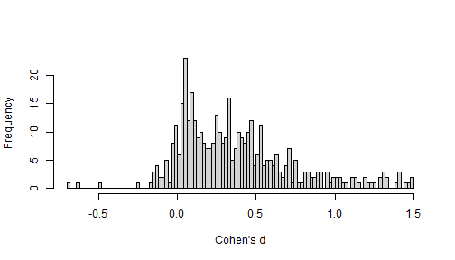
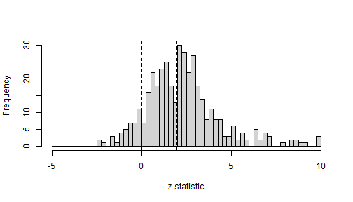
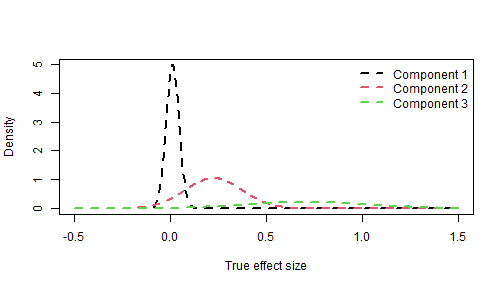
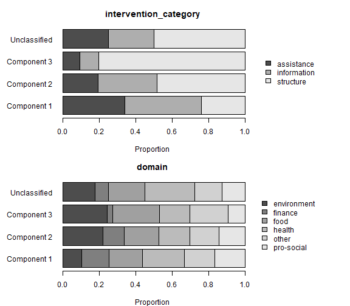

This vignette applies metamixr to a meta-analysis of choice-architecture ("nudge") interventions collected by Mertens et al. (2022), which are included in the package as `mertens_nudge`.


``` r
library(metamixr)
library(rstan)
library(bridgesampling)
```

## Data

The data set contains 447 effect sizes (Cohen's d) with their sampling
variances. Before fitting we remove effect sizes of 1.5 or larger in absolute
value, and the studies by Wansink, who had a large number of papers retracted due to evidence of research misconduct. This leaves 414 effect sizes.


``` r
data("mertens_nudge")
nudge <- subset(mertens_nudge, abs(cohens_d) < 1.5)
nudge <- nudge[!grepl("^Wansink", nudge$reference), ]
nrow(nudge)
#> [1] 414

y  <- nudge$cohens_d
sd <- sqrt(nudge$variance_d)
hist(y, breaks = 100, main = "", xlab = "Cohen's d")
```



The distribution of the z-statistics suggests publication bias as test statistics
pile up just above the significance threshold.


``` r
z <- y / sd
hist(z[z > -5 & z < 10], breaks = seq(-5, 10, by = 0.25), main = "", xlab = "z-statistic")
abline(v = c(0, qnorm(0.975)), lty = 2)
```



## Model specification

The selection model uses `steps = c(0.5, 0.975)`. This implies that significant p-values
on two-sided tests are more likely to be published than non-significant p-values and
among the non-significant p-values effects in the expected direction are more likely to be published than backfire effects.

We fit this selection model with one to four mixture components, and the
corresponding models without selection (`re_mix()`) for comparison.


``` r
M_max <- 4
fits_sel <- vector("list", M_max)
fits_re  <- vector("list", M_max)
for (m in 1:M_max) {
  fits_sel[[m]] <- sel_mix(y, sd, M = m, steps = c(0.5, 0.975),
                           chains = 4, cores = 4, iter = 20000, warmup = 10000,
                           seed = 1, refresh = 0)
  fits_re[[m]]  <- re_mix(y, sd, M = m,
                          chains = 4, cores = 4, iter = 20000, warmup = 10000,
                          seed = 1, refresh = 0)
}
```

## Convergence

Mixture models can have multimodal posteriors, in which case chains started
from different values settle in different modes and the usual convergence
diagnostics flag the fit. Before comparing models we therefore check, for
every fit, the largest R-hat of the model parameters and the number of
divergent transitions.


``` r
check_fit <- function(fit) {
  pars <- intersect(c("mu", "tau", "theta", "omega"), fit@model_pars)
  s <- rstan::summary(fit, pars = pars)$summary
  s <- s[is.finite(s[, "Rhat"]), , drop = FALSE]
  div <- sum(sapply(rstan::get_sampler_params(fit, inc_warmup = FALSE),
                    function(x) sum(x[, "divergent__"])))
  c(max_rhat = round(max(s[, "Rhat"]), 3), divergences = div)
}
conv <- rbind(t(sapply(fits_sel, check_fit)), t(sapply(fits_re, check_fit)))
rownames(conv) <- c(paste0("sel_mix M=", 1:M_max), paste0("re_mix M=", 1:M_max))
conv
#>             max_rhat divergences
#> sel_mix M=1    1.000           0
#> sel_mix M=2    9.766          53
#> sel_mix M=3    1.002           0
#> sel_mix M=4    1.005          51
#> re_mix M=1     1.000           0
#> re_mix M=2     1.000           0
#> re_mix M=3     1.000           0
#> re_mix M=4     1.019          25
```

The two-component selection model has not converged: an R-hat of almost 10 and
many divergent transitions likely imply that the four chains ended in
different modes of the posterior, so its parameter summaries and its marginal
likelihood below cannot be trusted. The multimodality vignette (`vignette("multimodality")`) shows how
to diagnose such multimodality by initialising chains in the different modes and comparing the marginal likelihoods across them.
All other models converged (R-hat at most 1.02), although the four-component models still show some divergent
transitions.

## Model comparison

To estimate the posterior probability of each model given the data, we can use bridgesampling to estimate each model's marginal likelihood.


``` r
fits <- c(fits_sel, fits_re)
names(fits) <- rownames(conv)
logml <- sapply(fits, function(f) bridge_sampler(f, silent = TRUE)$logml)
post_prob <- exp(logml - max(logml)) / sum(exp(logml - max(logml)))
round(cbind(logml = logml, post_prob = post_prob), 3)
#>                logml post_prob
#> sel_mix M=1 -132.626     0.000
#> sel_mix M=2  -85.358     0.000
#> sel_mix M=3  -75.471     0.539
#> sel_mix M=4  -75.628     0.461
#> re_mix M=1  -154.892     0.000
#> re_mix M=2  -115.559     0.000
#> re_mix M=3  -105.789     0.000
#> re_mix M=4  -107.965     0.000
```

Every model without selection is decisively rejected, and among the
selection models the data favour three or four components, with the evidence
split almost evenly between the two.

## Inspecting the selected model


``` r
best <- fits[[which.max(post_prob)]]
print(best, pars = c("mu", "tau", "theta", "theta_preselection", "omega"))
#> Inference for Stan model: selection_mix.
#> 4 chains, each with iter=20000; warmup=10000; thin=1; 
#> post-warmup draws per chain=10000, total post-warmup draws=40000.
#> 
#>                       mean se_mean   sd  2.5%  25%  50%  75% 97.5% n_eff Rhat
#> mu[1]                 0.01       0 0.01 -0.01 0.00 0.01 0.02  0.04  3367    1
#> mu[2]                 0.23       0 0.07  0.06 0.19 0.24 0.28  0.34  1994    1
#> mu[3]                 0.71       0 0.24  0.24 0.53 0.73 0.91  1.12  2472    1
#> tau[1]                0.03       0 0.01  0.00 0.03 0.04 0.04  0.05  1784    1
#> tau[2]                0.15       0 0.05  0.03 0.12 0.15 0.18  0.25  1115    1
#> tau[3]                0.33       0 0.09  0.16 0.26 0.34 0.39  0.49  4778    1
#> theta[1]              0.42       0 0.08  0.22 0.38 0.43 0.48  0.55  2183    1
#> theta[2]              0.39       0 0.09  0.21 0.34 0.40 0.45  0.55  8051    1
#> theta[3]              0.19       0 0.09  0.06 0.12 0.17 0.23  0.44  1846    1
#> theta_preselection[1] 0.63       0 0.09  0.40 0.58 0.64 0.69  0.77  2776    1
#> theta_preselection[2] 0.29       0 0.08  0.14 0.23 0.28 0.34  0.46  6426    1
#> theta_preselection[3] 0.09       0 0.06  0.02 0.04 0.07 0.11  0.24  2285    1
#> omega[1]              0.09       0 0.03  0.04 0.07 0.09 0.11  0.18  4707    1
#> omega[2]              0.25       0 0.06  0.15 0.21 0.24 0.28  0.37  4694    1
#> omega[3]              1.00       0 0.00  1.00 1.00 1.00 1.00  1.00   111    1
#> 
#> Samples were drawn using NUTS(diag_e) at Wed Sep 23 18:26:25 2026.
#> For each parameter, n_eff is a crude measure of effective sample size,
#> and Rhat is the potential scale reduction factor on split chains (at 
#> convergence, Rhat=1).
```

The estimated selection weights show that results in the unexpected direction and non-significant results
are far less likely to be published than significant ones. The components
can be visualised as the weighted normal densities of the true effects.


``` r
est <- rstan::summary(best, pars = c("mu", "tau", "theta"))$summary[, "mean"]
M   <- best@par_dims$mu
x   <- seq(-0.5, 1.5, length.out = 500)
dens <- sapply(1:M, function(m) {
  est[paste0("theta[", m, "]")] * dnorm(x, est[paste0("mu[", m, "]")], est[paste0("tau[", m, "]")])
})
matplot(x, dens, type = "l", lty = 2, lwd = 2, col = 1:M,
        xlab = "True effect size", ylab = "Density")
legend("topright", legend = paste("Component", 1:M), col = 1:M, lty = 2, lwd = 2, bty = "n")
```



## Which studies belong to which component?

`posterior_probs` gives, for every effect size, the posterior probability of
belonging to each component. To get a quick sense of the differences between
clusters we can inspect the study characteristics of effect sizes in different clusters.


``` r
probs <- rstan::extract(best, pars = "posterior_probs")$posterior_probs
p_mean <- apply(probs, c(2, 3), mean)          # effect sizes x components
nudge$component <- ifelse(apply(p_mean, 1, max) > 0.5,
                          paste("Component", apply(p_mean, 1, which.max)),
                          "Unclassified")
table(nudge$component)
#> 
#>  Component 1  Component 2  Component 3 Unclassified 
#>          126          182           66           40
```


``` r
par(mfrow = c(2, 1), mar = c(4, 7, 3, 12))
for (v in c("intervention_category", "domain")) {
  tab <- prop.table(table(nudge$component, nudge[[v]]), 1)
  barplot(t(tab), horiz = TRUE, las = 1, main = v, xlab = "Proportion",
          col = gray.colors(ncol(tab)), legend.text = TRUE,
          args.legend = list(x = "right", inset = c(-0.4, 0), bty = "n", xpd = TRUE))
}
```



``` r
par(mfrow = c(1, 1))
```

## References

Maier, M. (2026). Addressing heterogeneity with Bayesian meta-analytic
mixture modelling. *PsyArXiv*. https://doi.org/10.31234/osf.io/nkyqm_v2

Mertens, S., Herberz, M., Hahnel, U. J. J., & Brosch, T. (2022). The
effectiveness of nudging: A meta-analysis of choice architecture
interventions across behavioral domains. *Proceedings of the National
Academy of Sciences*, 119(1), e2107346118.
https://doi.org/10.1073/pnas.2107346118
